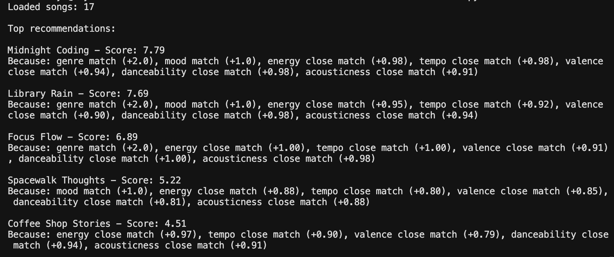
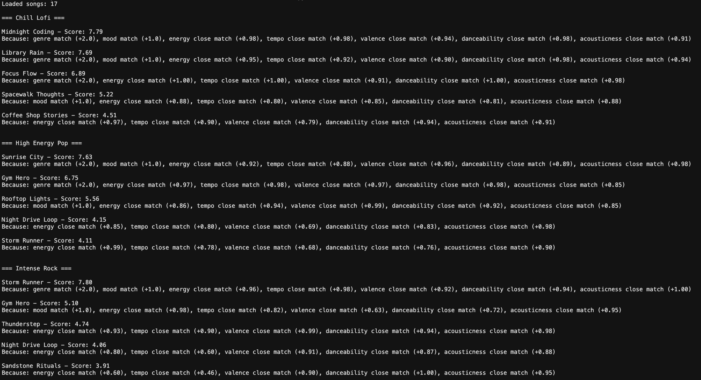

# 🎵 Music Recommender Simulation

## Project Summary

In this project you will build and explain a small music recommender system.

Your goal is to:

- Represent songs and a user "taste profile" as data
- Design a scoring rule that turns that data into recommendations
- Evaluate what your system gets right and wrong
- Reflect on how this mirrors real world AI recommenders

Replace this paragraph with your own summary of what your version does.

---

## How The System Works

This music recommender system uses a content-based approach to suggest songs based on a user's preferences. It compares song features like genre, mood, energy, and tempo to a user’s preferred values and assigns each song a score based on how closely it matches.
Songs with matching genres and moods receive higher scores, while numerical features like energy and tempo are scored based on how close they are to the user’s preferences. The system then ranks songs by their scores and recommends the top results.
In real-world systems, this approach is often combined with collaborative filtering, but this simulation focuses on matching song attributes to user taste.
The scoring system uses weighted rules. A song receives +2.0 points for a genre match and +1.0 point for a mood match. Additional similarity points are given based on how close the song’s energy, tempo, valence, danceability, and acousticness are to the user’s preferences. Songs are then ranked by total score, and the top results are recommended.
This system may be biased toward genre and mood matches, which could cause it to overlook songs that match the user’s vibe in other ways. It also relies on a small dataset, so it may not represent all musical tastes.

### Features Used

**Song:**
- genre
- mood
- energy
- tempo_bpm
- valence
- danceability
- acousticness

**UserProfile:**
- preferred_genre
- preferred_mood
- preferred_energy
- preferred_tempo

---

## Example Output



## Evaluation Results

Here are the results of the recommender for different user profiles:



## Getting Started

### Setup

1. Create a virtual environment (optional but recommended):

   ```bash
   python -m venv .venv
   source .venv/bin/activate      # Mac or Linux
   .venv\Scripts\activate         # Windows

2. Install dependencies

```bash
pip install -r requirements.txt
```

3. Run the app:

```bash
python -m src.main
```

### Running Tests

Run the starter tests with:

```bash
pytest
```

You can add more tests in `tests/test_recommender.py`.

---

## Experiments You Tried

### Accuracy
For the Chill Lofi profile, the recommendations felt accurate. Songs like *Midnight Coding* and *Library Rain* ranked highly because they matched both the genre and mood preferences, which have the highest weights in the scoring system.

### Why a song ranked first
For example, *Midnight Coding* ranked first because it matched both genre (+2.0) and mood (+1.0). It also had very close values for energy, tempo, and acousticness, which added additional points and gave it the highest total score.

### Surprises
One surprising result was that some songs without a genre match still ranked relatively high. This happened because their numerical features (like energy and tempo) were very close to the user’s preferences, showing that similarity scoring can sometimes outweigh exact matches.

### Experiment: Removing Mood Feature

I tested the system by temporarily removing the mood match from the scoring function. After doing this, the rankings changed in noticeable ways. For the Chill Lofi profile, *Focus Flow* moved to the top, while *Midnight Coding* and *Library Rain* ranked slightly lower than before.

This happened because the system relied more on numerical features like energy, tempo, and danceability once the mood bonus was removed. The results were not necessarily worse, but they felt a little less aligned with the overall vibe of the profile. This showed that mood is an important feature in my recommender because it helps capture the emotional feel of the music, not just the technical similarity.
---

## Limitations and Risks

This recommender system has several limitations. It relies on a small dataset, so it cannot represent all types of music or user preferences. The system also places strong weight on genre and mood, which can cause it to overlook songs that match the user’s vibe in other ways.

Additionally, the system only considers numerical features like energy, tempo, valence, and danceability. It does not account for lyrics, cultural context, or personal listening history, which makes it less accurate compared to real-world recommendation systems.
---

## Reflection

Read and complete `model_card.md`:

[**Model Card**](model_card.md)

Through this project, I learned how recommender systems turn user preferences into numerical scores to rank items. Even simple rules like matching genre or comparing energy levels can produce reasonable recommendations.

I also saw how bias can appear in systems like this. For example, giving too much weight to genre can limit diversity, while relying on a small dataset can restrict the variety of recommendations. This made me realize that real-world systems need much more data and more complex logic to be fair and accurate.


---

## 7. `model_card_template.md`

Combines reflection and model card framing from the Module 3 guidance. :contentReference[oaicite:2]{index=2}  

```markdown
# 🎧 Model Card - Music Recommender Simulation

## 1. Model Name

Give your recommender a name, for example:

> VibeFinder 1.0

---

## 2. Intended Use

- What is this system trying to do
- Who is it for

Example:

> This model suggests 3 to 5 songs from a small catalog based on a user's preferred genre, mood, and energy level. It is for classroom exploration only, not for real users.

---

## 3. How It Works (Short Explanation)

Describe your scoring logic in plain language.

- What features of each song does it consider
- What information about the user does it use
- How does it turn those into a number

Try to avoid code in this section, treat it like an explanation to a non programmer.

---

## 4. Data

Describe your dataset.

- How many songs are in `data/songs.csv`
- Did you add or remove any songs
- What kinds of genres or moods are represented
- Whose taste does this data mostly reflect

---

## 5. Strengths

Where does your recommender work well

You can think about:
- Situations where the top results "felt right"
- Particular user profiles it served well
- Simplicity or transparency benefits

---

## 6. Limitations and Bias

Where does your recommender struggle

Some prompts:
- Does it ignore some genres or moods
- Does it treat all users as if they have the same taste shape
- Is it biased toward high energy or one genre by default
- How could this be unfair if used in a real product

---

## 7. Evaluation

How did you check your system

Examples:
- You tried multiple user profiles and wrote down whether the results matched your expectations
- You compared your simulation to what a real app like Spotify or YouTube tends to recommend
- You wrote tests for your scoring logic

You do not need a numeric metric, but if you used one, explain what it measures.

---

## 8. Future Work

If you had more time, how would you improve this recommender

Examples:

- Add support for multiple users and "group vibe" recommendations
- Balance diversity of songs instead of always picking the closest match
- Use more features, like tempo ranges or lyric themes

---

## 9. Personal Reflection

A few sentences about what you learned:

- What surprised you about how your system behaved
- How did building this change how you think about real music recommenders
- Where do you think human judgment still matters, even if the model seems "smart"


